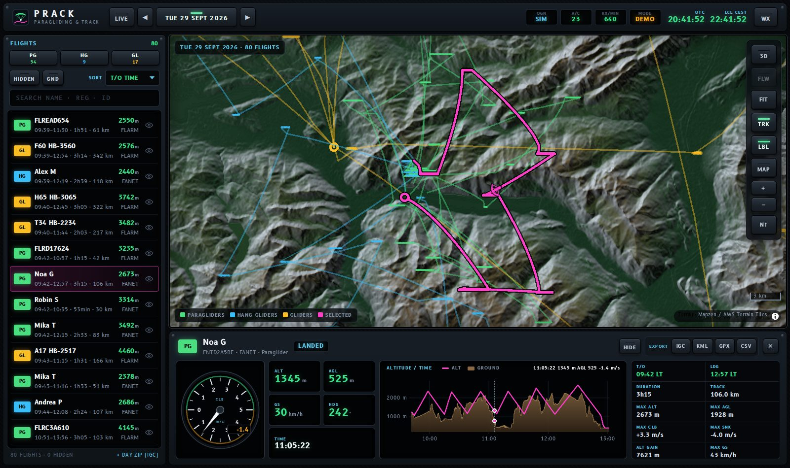
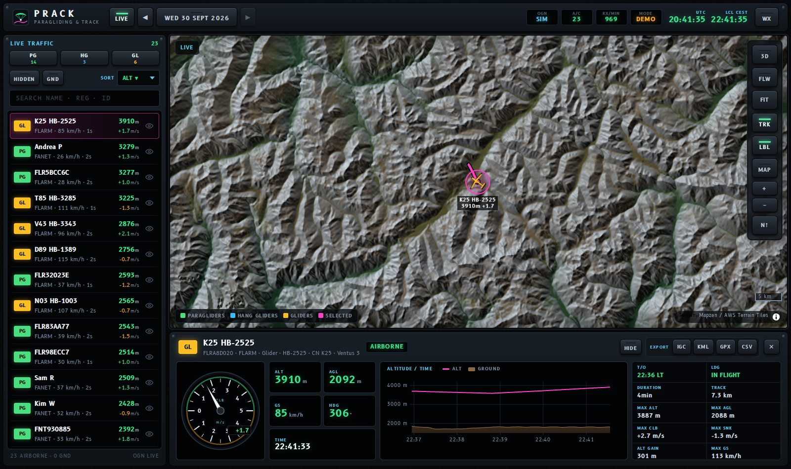
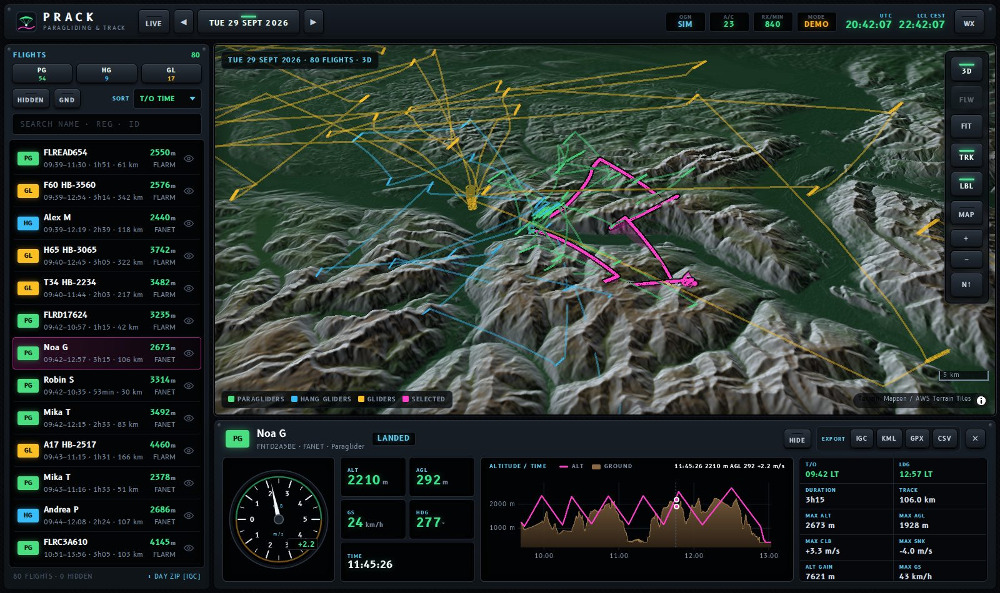
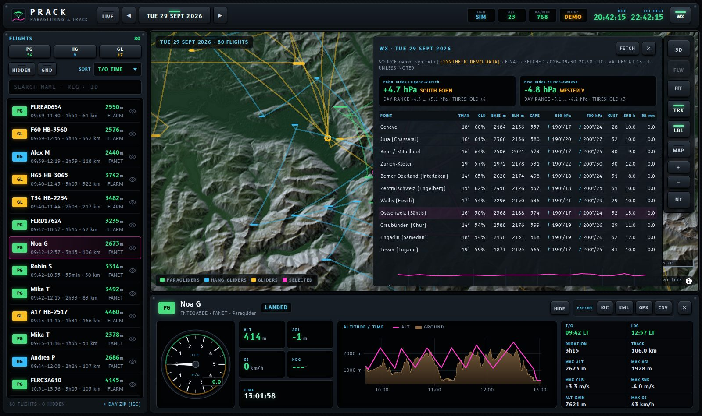

# prack · paragliding & track

**prack** tracks paragliders, hang gliders (deltas) and gliders (Segelflugzeuge) that fly with
**FLARM** or **FANET** switched on, using the [Open Glider Network (OGN)](https://www.glidernet.org).
It shows live traffic on a 2D/3D map, records every flight in a database, archives the weather
of each day and lets you go back in time with a calendar. The UI is styled like a glass cockpit.

Built for **Switzerland**, but every region-specific setting lives in one small file, so adding
Austria, the French Alps or anywhere else takes a few minutes (see [Regions](#regions)).



| Live traffic | 3D track with curtain | Calendar & daily weather |
|---|---|---|
|  |  |  |

## Features

- **Live map**: all paragliders, hang gliders and gliders received by OGN: FLARM, FANET, OGN
  trackers and the apps and services relayed by OGN (SeeYou Navigator / Naviter, Flymaster,
  SafeSky, PureTrack, SkyBase, VarioVoice, ...), with heading-oriented symbols, trails and labels.
  Updates are pushed to the browser every ~1.5 s (server-sent events).
- **Flight details**: select an aircraft or flight to see identity (FANET pilot name, OGN device
  database registration / competition number), variometer, altitude, AGL, ground speed, heading,
  statistics and the **route flown**.
- **Barogram**: altitude over time (magenta) with the **terrain below the aircraft as a filled
  ground profile**. Hover the chart to move a marker along the track on the map.
- **2D / 3D**: one click switches to 3D terrain; tracks are drawn at their true altitude with a
  translucent curtain down to the ground. Follow mode keeps the selected aircraft in view.
- **Flight archive**: every flight is stored with all its fixes (position, altitude, ground
  elevation, speed, track, climb, turn rate, receiving station, signal quality, ...) and its
  statistics (take-off / landing, duration, distance, max altitude / AGL, best climb / sink, ...).
  Take-off, landing, coverage gaps and resumed flights are detected automatically.
- **Calendar**: go back to any day, see the number of flights per day and category, and show all
  flights of that day on the map.
- **Hide / unhide** flights (eye button or `H`), **filter** by paraglider / hang glider / glider,
  **sort** by take-off time, duration, distance, altitude, name, ... and search.
- **Downloads**: IGC, KML (3D curtain for Google Earth), GPX, CSV, GeoJSON per flight, and a ZIP
  with the IGC files, an index and the weather of a whole day.
- **Daily weather archive** from [Open-Meteo](https://open-meteo.com) for representative points
  (Jura, Mittelland, Berner Oberland, Wallis, Engadin, Tessin, ...): hourly temperature, dew
  point, clouds, boundary layer height, CAPE, winds and temperatures at 850/700/500 hPa, sunshine,
  precipitation, plus derived values (cumulus base, lapse rate) and the **föhn (Lugano–Zürich)**
  and **bise (Zürich–Genève)** pressure indices. The weather at take-off is shown with each flight.
- **Base maps**: swisstopo (colour / grey), SWISSIMAGE, ICAO and glider charts (BAZL),
  OpenTopoMap, OpenStreetMap, satellite, and a dark terrain relief that works everywhere.
- **Privacy**: OGN *no-tracking* and *stealth* flags and the OGN device database settings
  (*don't track*, *don't identify*) are honoured.
- Runs on a laptop (SQLite, one process) and on a small server (Docker, optional PostgreSQL,
  HTTPS via Caddy, basic auth).

## Quick start (your computer)

Requirements: Python 3.11+.

```bash
git clone <this repository> prack && cd prack
python3 -m venv .venv
source .venv/bin/activate          # Windows PowerShell: .venv\Scripts\Activate.ps1
pip install .

prack run                          # live OGN data  -> http://127.0.0.1:8000
prack run --demo                   # simulated traffic + two simulated past days
```

After downloading a newer version, run `pip install .` again (it also picks up new dependencies).

Demo mode needs no OGN connection: it simulates paragliders, hang gliders and gliders over
well-known Swiss sites, fills two past days into the archive and, if Open-Meteo cannot be reached,
stores clearly labelled synthetic weather. Use a separate data folder for it
(`PRACK_DATA_DIR=demo-data prack run --demo`) so demo flights don't mix with real ones.

### Keyboard

| Key | Action |
|---|---|
| `L` | live traffic |
| `←` / `→` | previous / next day |
| `3` | toggle 2D / 3D |
| `F` | follow the selected aircraft |
| `W` | weather of the day |
| `H` | hide / unhide the selected flight |
| `Esc` | close popups / deselect |

Shift-click a category key (PG / HG / GL) to show only that category.

## Configuration

Everything is configured with environment variables or a `.env` file in the working directory.
[`.env.example`](.env.example) lists all options. The most important ones:

| Variable | Default | |
|---|---|---|
| `PRACK_HOST` / `PRACK_PORT` | `127.0.0.1` / `8000` | listen address |
| `PRACK_DATA_DIR` | `data` | SQLite database and terrain tile cache |
| `PRACK_DATABASE_URL` | SQLite | e.g. `postgresql+psycopg://user:pw@host/prack` |
| `PRACK_REGIONS` | `ch` | comma separated region ids |
| `PRACK_TRACKED_TYPES` | `1,6,7` | OGN aircraft types (1 glider, 6 hang glider, 7 paraglider, ...) |
| `PRACK_MIN_FIX_INTERVAL` | `2` | seconds between stored fixes per aircraft |
| `PRACK_AUTH_USER` / `PRACK_AUTH_PASSWORD` | – | HTTP basic auth for the whole app |
| `PRACK_DEMO` | `false` | simulated traffic instead of OGN |

The interactive API documentation is at `/api/docs`.

### Command line

```bash
prack run [--demo] [--host 0.0.0.0] [--port 8000]
prack weather --date 2026-07-15 --days 7   # download the weather of past days
prack ddb                                  # refresh the OGN device database now
prack diagnose --seconds 60                # listen to OGN and report what arrives / why it is dropped
prack export 123 --format igc              # export flight 123
prack replay capture.txt --date 2026-07-15 # feed raw APRS lines (e.g. a capture) through the tracker
prack demo-seed --days 3                   # simulate past days (demo data)
```

### Troubleshooting

- **No aircraft although OGN is connected**: run `prack diagnose --seconds 120` while traffic is
  visible on [live.glidernet.org](https://live.glidernet.org). It lists every aircraft received,
  its type and source, and why it is shown or dropped (type not tracked, no-tracking flag,
  outside the region, ...). Aircraft on the ground are only listed with the **GND** key on.
- **Plausibility rules**: ADS-B targets in the "ultralight / hang glider / paraglider" category are
  microlights and count as *unknown*. A "paraglider" that repeatedly flies faster than 130 km/h
  (hang glider: 180 km/h) is a wrongly configured device and is dropped; flights stored before
  are removed on the next start.
- **One aircraft, several protocols**: a vario that sends e.g. FANET and ADS-L (or FLARM and ADS-L)
  is shown and recorded once, under the preferred source: FANET (it carries the pilot's name),
  then FLARM, OGN tracker, ADS-L. If the preferred source is heard later, the entry and its flight
  switch over; flights recorded twice by older versions are merged on the next start.
- Some sources (LiveTrack24, SPOT, Spider, SkyLines, Capturs, AirMate) do not transmit an aircraft
  type. They are "Unknown" and not tracked by default; add type `0` to `PRACK_TRACKED_TYPES` to
  include them (shown as OTH).
- **Windows**: prack needs the `tzdata` package (installed automatically since 0.1.0 of this
  branch; run `pip install .` again after updating).

## Regions

A region is a TOML file in [`prack/regions`](prack/regions) (or in `PRACK_REGIONS_DIR`):
bounding box, time zone, base maps, weather points and pressure gradients.
[`ch.toml`](prack/regions/ch.toml) is the Swiss one. To add e.g. Austria, copy it to `at.toml`,
change `id`, `name`, `bbox`, `center`, the weather points (and drop the swisstopo layers), then
start with `PRACK_REGIONS=ch,at`. Terrain, weather and the generic base maps are global.

New flights are opened only inside a region's box. The OGN feed is requested with a margin
(`PRACK_OGN_FILTER_MARGIN_KM`, 30 km) so that cross-border legs of Swiss flights are kept.

## Data

- **Database**: SQLite by default (`data/prack.db`, WAL mode), PostgreSQL optional. Tables:
  `devices`, `flights`, `fixes` (one row per position, clustered by flight and time), `weather`
  (per day and point: summary, hourly and daily values), `ddb` (OGN device database copy).
- **Storage**: a fix takes roughly 60–70 bytes in SQLite. With the default of one fix per 2 s,
  a 2-hour paraglider flight is about 3600 fixes (~0.25 MB). A busy Swiss summer day with several
  hundred flights is in the order of 100–200 MB. Increase `PRACK_MIN_FIX_INTERVAL` to store less.
- **Terrain**: ground elevation below each fix (AGL, barogram ground, 3D terrain) comes from the
  global [Terrain Tiles](https://registry.opendata.aws/terrain-tiles/) dataset (~30 m resolution
  in the Alps), cached in `data/dem`.
- **Backups**: stop the service and copy `data/`, or use `sqlite3 data/prack.db ".backup backup.db"`
  while it runs.
- **Schema changes**: tables are created automatically on start; there are no migrations yet,
  so after updates that change the schema a fresh database may be needed (see the release notes).

## Deployment

### Docker Compose (any Linux server, including Oracle Cloud ARM)

```bash
cp .env.example .env               # set PRACK_AUTH_USER / PRACK_AUTH_PASSWORD!
docker compose up -d --build       # http://<server>:8000
```

With a domain name and automatic HTTPS (Let's Encrypt via Caddy): set `PRACK_DOMAIN=prack.example.com`
and `PRACK_PUBLISH=127.0.0.1:8000` in `.env`, point the DNS record at the server, then
`docker compose --profile https up -d --build`.

For PostgreSQL add `--profile postgres` and set `PRACK_DATABASE_URL` / `POSTGRES_PASSWORD`.
SQLite is perfectly fine for a single-user installation.

### Oracle Cloud "Always Free"

1. Create an **Ampere A1** instance (ARM, up to 4 OCPU / 24 GB RAM are free) with Ubuntu.
2. In the VCN *security list* add ingress rules for TCP 80 and 443 (or 8000 without HTTPS).
3. Oracle's Ubuntu images also block ports in the host firewall:
   `sudo iptables -I INPUT 6 -p tcp -m multiport --dports 80,443 -j ACCEPT && sudo netfilter-persistent save`
4. Install Docker (`curl -fsSL https://get.docker.com | sh`), clone the repository and follow the
   Docker Compose steps above. The image builds natively on ARM.

### Without Docker (systemd)

See [`deploy/prack.service`](deploy/prack.service): install into a virtualenv under `/opt/prack`,
put the settings into `/opt/prack/.env` and enable the unit. Put nginx or Caddy in front for HTTPS;
disable proxy buffering for `/api/live/stream` (server-sent events).

## OGN data usage

prack reads the public OGN APRS feed read-only (`aprs.glidernet.org:14580`, area filter).
Please respect the OGN data usage rules (see [glidernet.org](https://www.glidernet.org) and the
[OGN device database](https://ddb.glidernet.org)): prack drops
aircraft with the *no-tracking* flag, stealth aircraft (`PRACK_RESPECT_STEALTH`) and devices marked
*not tracked* in the OGN device database, and hides registrations of devices marked
*not identified*. Keep a public installation behind basic auth: stored tracks of other pilots are
personal data.

## Development

```bash
pip install -e ".[dev]"
pytest                             # parser, tracker, exports, weather, API, APRS client
PRACK_DEMO=1 prack run             # UI development with simulated traffic
```

```
prack/
  ogn/          APRS-IS client, beacon parser, device database, traffic simulator
  tracking/     flight state machine (take-off / landing / gaps), statistics, geo helpers
  elevation.py  Terrarium DEM tiles -> ground elevation
  weather.py    Open-Meteo daily archive, föhn / bise indices
  export.py     IGC, GPX, KML, GeoJSON, CSV
  api.py        FastAPI routes, server-sent events, basic auth
  runtime.py    background threads (feed, processing, finalizer, weather, DDB)
  regions/      region definitions (ch.toml)
  static/       web app (plain ES modules; MapLibre GL, deck.gl, uPlot and the B612 cockpit font
                are vendored, no build step)
```

The front end deliberately has no build step: the Python package serves everything, so a
deployment needs nothing but Python (or Docker). [`scripts/update_vendor.sh`](scripts/update_vendor.sh)
re-downloads the vendored libraries (MapLibre GL 5.24, deck.gl 9.4, uPlot 1.6).

## Limitations and ideas

- Tracks are reconstructed from what OGN ground stations receive. In the Alps there are coverage
  holes; prack bridges gaps of up to 90 minutes, but the track is straight across them.
- OGN reports GPS altitude only: exported IGC files repeat it in the pressure altitude field.
- The IGC files are not signed (not valid for competitions or XContest verification).
- Possible next steps: airspace overlay, replay with a time slider, thermal detection and
  statistics, comparing flights against the stored weather, multi-user accounts.
